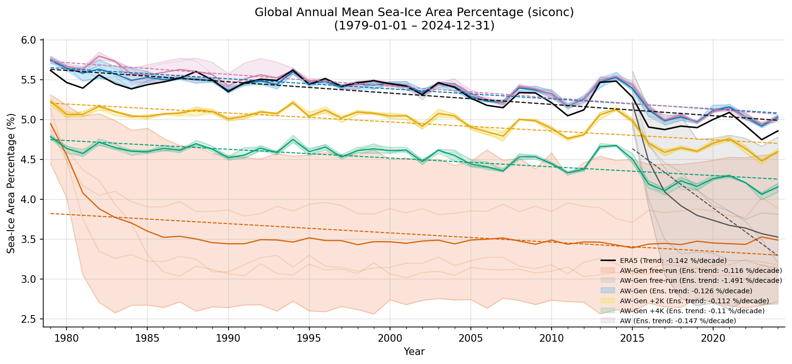
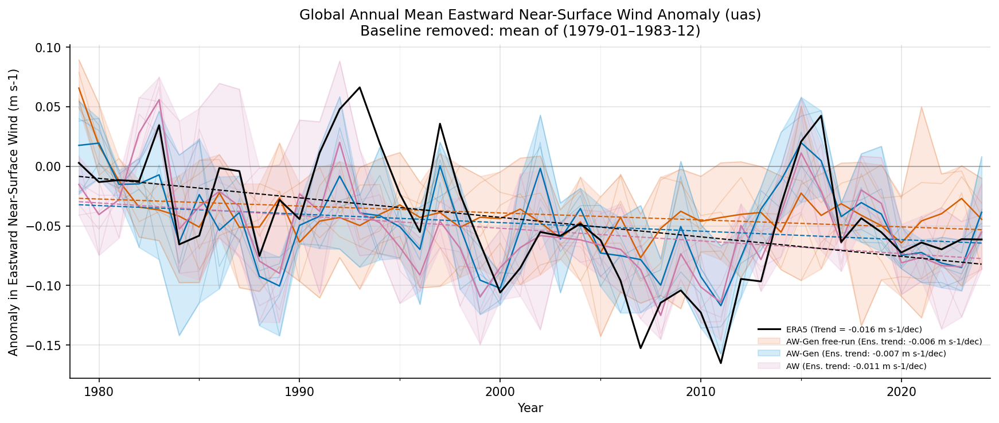
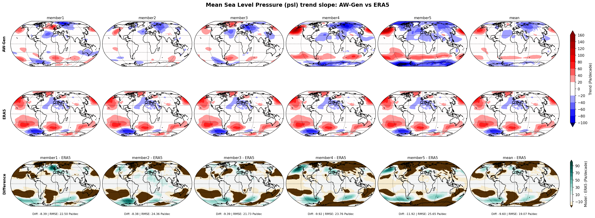
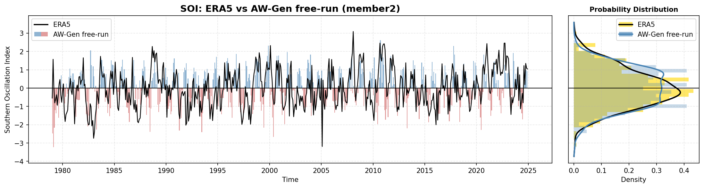
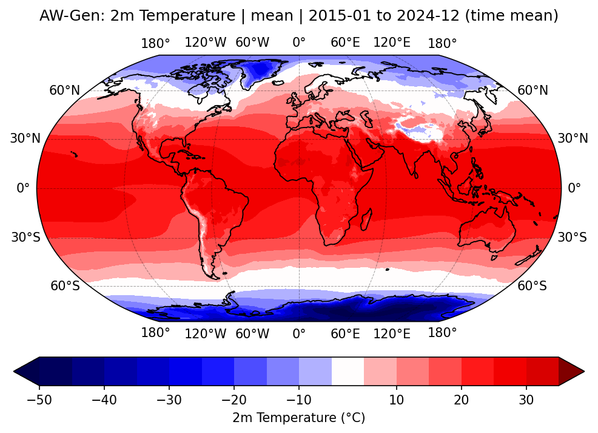
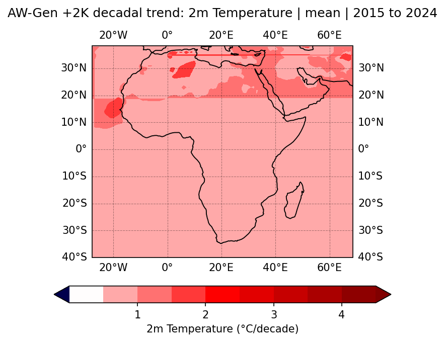
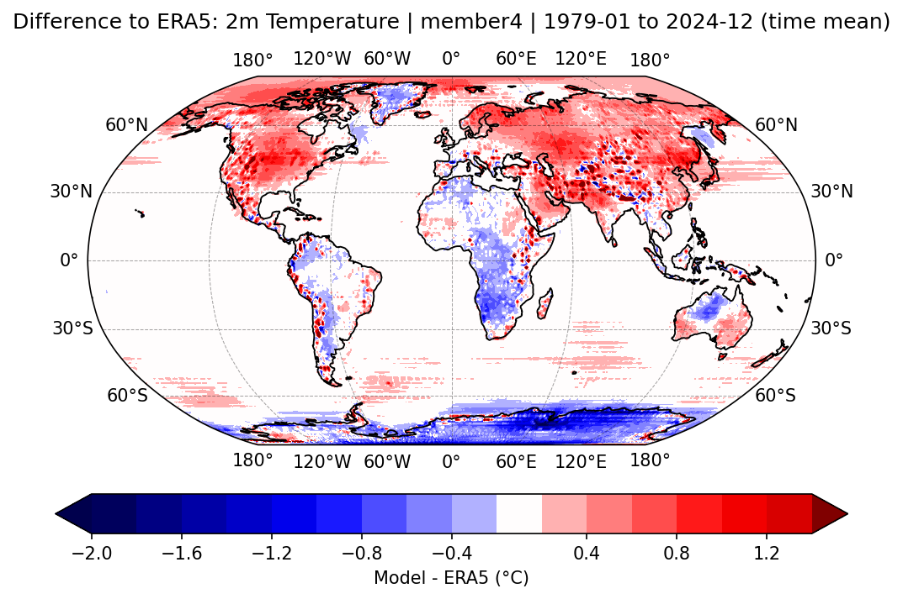
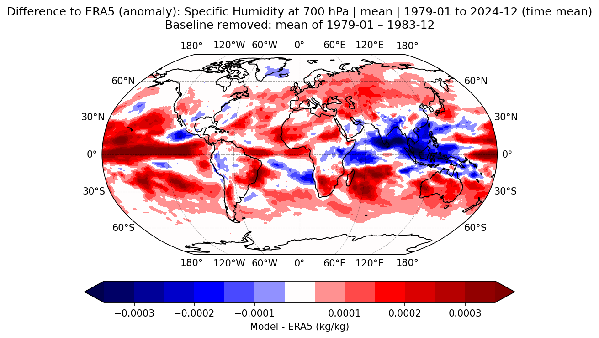
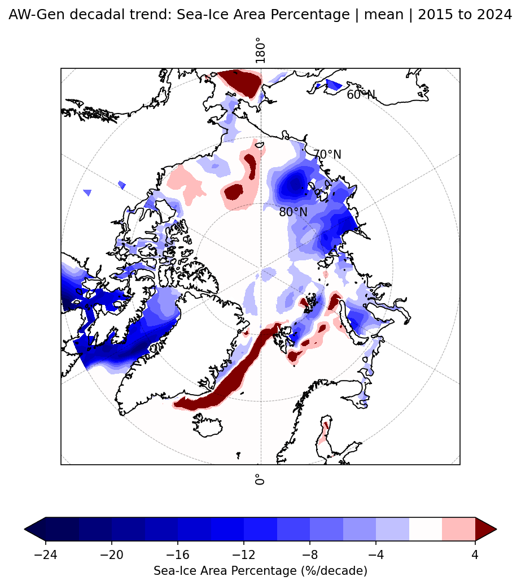
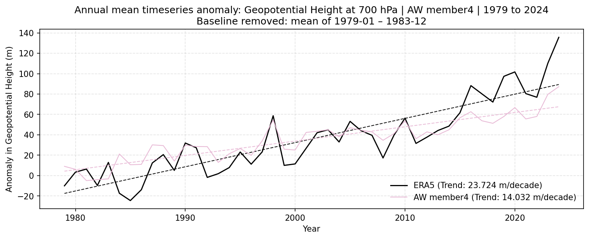

# AIMIP Evaluation Framework

Evaluation and visualisation framework for analysing **CMORised climate model output** against **ERA5** or other CMORised models*.

This repository was developed as part of the Master's thesis:

**“On the suitability of ArchesWeatherGen for Climate Projections.”**

The implemented functionality includes:

- Global mean time series
- Global mean anomaly time series
- Spatial bias maps
- Southern Oscillation Index (SOI)
- Flexible custom plots (maps and time series for arbitrary combinations of variables, pressure levels, locations, timespans, and methods (out of those presented above))

The system is fully controlled via Hydra, allowing flexible evaluation setups without modifying the code.

\*If you need to CMORise your data first, see my CMORisation code:  
https://github.com/AntoniaJost/geoarches_evaluation

---

# Repository Structure

```

thesis_evaluation/
│
├─ evaluation/
│ ├─ main.py # entry point for running evaluations
│ ├─ general_functions.py # shared helper functions
│ ├─ range_summary.py # compute ranges used for plotting
│ │
│ ├─ metrics/
│ │ ├─ anomalies.py
│ │ ├─ bias_map.py
│ │ ├─ global_mean.py
│ │ ├─ individual_plots.py
│ │ └─ soi.py
│ │
│ └─ config/
│ ├─ config.yaml
│ ├─ datasets.yaml
│ ├─ periods.yaml
│ ├─ variables.yaml
│ └─ plots/
│
├─ environment.yml
└─ run_eval.sh # example execution script

```

---

# Requirements

* Python 3.11
* CMORised climate model output
* ERA5 data

# Installation

## 1. Clone the repository

```bash
git clone https://github.com/AntoniaJost/thesis_evaluation.git
cd thesis_evaluation
````

## 2. Create the conda environment

```bash
conda env create -f environment.yml
conda activate thesis_eval
```

The environment includes all required dependencies.

---

# Configuration

All relevant parameters are controlled through **configuration files** in `evaluation/config/`.

Important configuration files:

| File             | Purpose                          |
| ---------------- | -------------------------------- |
| `config.yaml`    | Main configuration               |
| `datasets.yaml`  | Dataset paths and model metadata |
| `variables.yaml` | Variable metadata (names, units) |
| `periods.yaml`   | Evaluation time ranges           |
| `plots/*.yaml`   | Plot configuration files         |

---

# Getting Started

I recommend starting with reviewing the following files:

* `datasets.yaml`
* `variables.yaml`
* `periods.yaml`

Make sure these settings match your data structure and analysis needs.

If you are working on **Levante**, you can reuse my already regridded ERA5 data.
The default evaluation periods in follow the **AIMIP guidelines**.

Once those are set up, proceed to `config.yaml`.

Here you may need to adjust:

* conversion rules
* file patterns
* members
* models included in the range summary


## Range Summary (optional but recommended)

Before producing plots, run the **range summary** script (example):

```bash
python -m evaluation.range_summary \
  'range_summary.models_to_process=["free_run_control","free_run_prediction","forced_sst","forced_sst_2k","forced_sst_4k","archesweather"]' \
  'range_summary.tag=_ALL'
```

The resulting CSV files store **consistent min/max ranges** for each variable and pressure level.
This ensures that plots remain **comparable across models**.

Runtime depends on dataset size. It might take up to ~6 hours for

  * 6 models
  * 5 members
  * 13 variables

If you are evaluating **ArchesWeatherGen**, you may use the precomputed files in `outputs/range_summary` (*will be uploaded soon*).

If you skip this step, plotting ranges will be determined dynamically.

---

# Running the Evaluation

The evaluation is executed via:

```bash
python -m evaluation.main
```

Example runs are provided in:

```
run_eval.sh
```

Hydra allows configuration overrides directly from the command line, so the files in `config/plots/` rarely need to be edited.

---

# Overview Plots vs Detailed Analysis

The following plot types provide a **quick overview**:

* `global_mean`
* `anomalies`
* `bias_map`
* `soi`

Typical workflow:

1. Generate those (overview) plots for all models
2. Inspect the results
3. Use **`individual_plots`** to analyse specific cases in more detail

For example:

* zoom into a particular region
* analyse a specific pressure level
* plot a dedicated time series


## Detailed Analysis with `individual_plots`

This script is highly flexible.

Available options include:

* daily or monthly resolution
* map or time series plots
* statistics:

  * raw data
  * annual mean
  * decadal trend
* difference to ERA5
* anomaly calculation (baseline removal)
* plotting individual members or ensemble mean
* spatial domain selection:

  * global
  * custom bounding box
  * Arctic
  * Antarctic
* plotting ERA5 maps directly

Most options can be combined.

---

# Output

Outputs are written to the directory defined in `config.yaml`.

Typical structure:

```
outputs/
├─ anomalies/
├─ bias_map/
├─ global_mean/
├─ individual_plots/
│  ├─ map/
│  └─ timeseries/
├─ range_summary/
└─ soi/
```

The file names aim to encode all relevant metadata:

```
method_variable_model_member_region_timeperiod_statistic.png
```

---

# Example Plots

Below are examples of the different plots generated by the framework.


## Global Mean Time Series



## Anomaly Time Series



## Bias Map



## Southern Oscillation Index




## Individual Spatial Maps




## Difference Map (Model − ERA5)



## Difference & Anomaly Map



## Decadal Trend Map



## Individual Time Series



---

# Known Issues / Limitations

As this code was primarily developed to produce plots for my Master's thesis, it is not yet a fully general-purpose package.

Known limitations include:

* If multiple variables with pressure levels are selected simultaneously, only a single `plev` selection can be set. That or those same pressure level(s) will then be applied to all variables.
* Daily ERA5 evaluation may fail because my current dataset only contains monthly ERA5 data. Daily model data therefore cannot always be compared directly.
* Plotting **ERA5 only** in `individual_plots` requires at least one model to be specified because certain metadata are inferred from the model configuration.
* Bias map computation is relatively slow and can take **>12 hours for multiple models**.
* The code assumes a specific folder structure.

Example structure:

```
cmorised_awm/
└─ archesweather/
   └─ member2/
      └─ Amon/
         └─ hus/
            └─ gn/
               hus_Amon_ArchesWeather_aimip_r2i1p1f1_gn_197810-202501.nc
```

* Some settings (e.g. colours) are currently tied to specific model names.

If you discover additional issues, please open an issue on GitHub.

---

# Notes

* ERA5 ([Hersbach et al., 2020](https://onlinelibrary.wiley.com/doi/abs/10.1002/qj.3803)) is used as the observational reference dataset.
* Difference plots are computed as `Model − ERA5`
* Plot colour ranges can be:

  * dynamically computed
  * read from precomputed summary statistics (`range_summary.py`)

---

# Citation

The code is currently work in progress and not yet archived on Zenodo.

If you use this code, please provide appropriate credit.

---

# License

Copyright 2026 Antonia Anna Jost

Licensed under the Apache License, Version 2.0.

[http://www.apache.org/licenses/LICENSE-2.0](http://www.apache.org/licenses/LICENSE-2.0)
